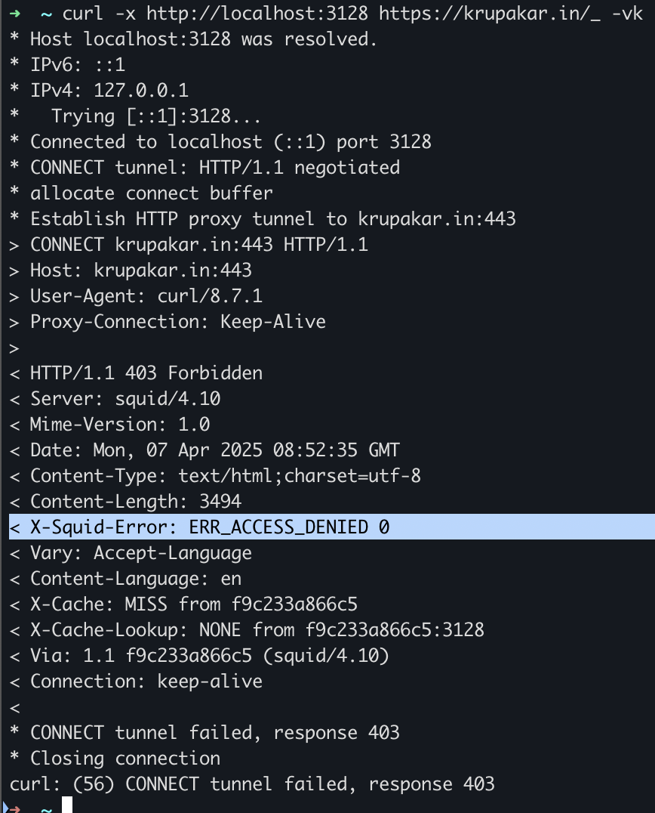

# Squid Proxy

This is a simple use-case of using **Squid Proxy** inside Docker to whitelist specific domains and restrict internet access. It’s ideal for DevOps use cases such as controlling egress traffic, simulating restricted networks, or adding an extra layer of security in development environments.

Eg: when i NOT added particular dns as whitelisted, the access is restricted.



---

## What is Squid Proxy?

**Squid** is a high-performance, open-source **HTTP and HTTPS proxy server** and **web caching daemon**.

It acts as a **middleman** between clients (e.g., browsers, services, CI pipelines) and the internet. Squid helps control, filter, monitor, and optimize outbound traffic.

---

## What is Squid Used For?

| Feature              | Description |
|----------------------|-------------|
| **Access Control** | Allow or block traffic to specific domains, ports, IPs, or protocols. |
|  **Caching**        | Store frequently accessed content locally, reducing latency and bandwidth. |
|  **Monitoring**     | Log all HTTP(S) traffic for auditing or debugging. |
| ️ **Security**       | Block malicious or unwanted sites, reducing attack surfaces. |
|  **Proxy Gateway**  | Route outbound traffic through one controlled point. |

---

## when should you use Squid Proxy?

You should consider Squid in scenarios like:

- **Whitelisting only trusted domains** for security or compliance.
- **Locking down CI/CD environments** to access only approved registries (e.g., GitHub, Artifactory).
-  **Adding a proxy layer to inspect or log** all outgoing requests.
-  **Simulating air-gapped/cloud-restricted environments** during development.
-  **Centralizing internet access** from multiple services or users in secure environments.

---

##  DevOps / Platform Engineering Use Cases

| Use Case | Description |
|----------|-------------|
|  **CI/CD Egress Control** | Prevent pipelines from reaching unapproved URLs. |
| ️ **Zero Trust Network Setup** | Enforce internet access only via a known proxy. |
|  **Air-gapped Environment Testing** | Replicate production-like locked-down networks locally. |
|  **Registry Whitelisting** | Allow only PyPI, npm, Maven, GitHub, etc. |
|  **Traffic Auditing** | Inspect and debug unexpected traffic from services. |
|  **Developer Sandbox** | Allow only specific services (e.g., Slack API, GitHub) in a dev container. |

---

## whitelisting the dns:

This file(whitelist.txt) contains the list of domains you want to allow: 

```text
.example.com
.httpbin.org
.api.github.com

```
---

## Testing the Proxy:
curl -x http://localhost:3128 http://example.com        # ✅ Allowed. <br>
curl -x http://localhost:3128 http://google.com         # ❌ Blocked. <br>

export http_proxy=http://localhost:3128 <br>
export https_proxy=http://localhost:3128 <br>

curl http://httpbin.org/ip      # ✅ Allowed  <br> 
curl http://facebook.com        # ❌ Blocked.  <br>

unset http_proxy https_proxy

For logs - `docker exec -it squid-proxy tail -f /var/log/squid/access.log`


🚫 HTTPS domain restrictions work without decrypting traffic — Squid blocks based on SNI/CONNECT headers.

You can use this setup even in local dev environments to simulate secure network policies.

#### Next-Level Configurations

- Add authentication (username/password) to the proxy.

- Set up SSL Bump for full HTTPS decryption (requires certificates).

- Deploy in Kubernetes for centralized egress control.

- Use Git or S3 to sync whitelist files across environments.

- Integrate with Cloud NAT or Tunnels for remote proxying.